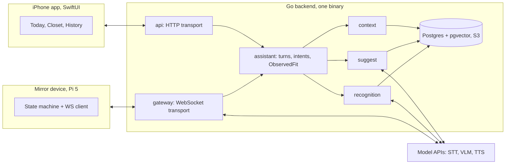
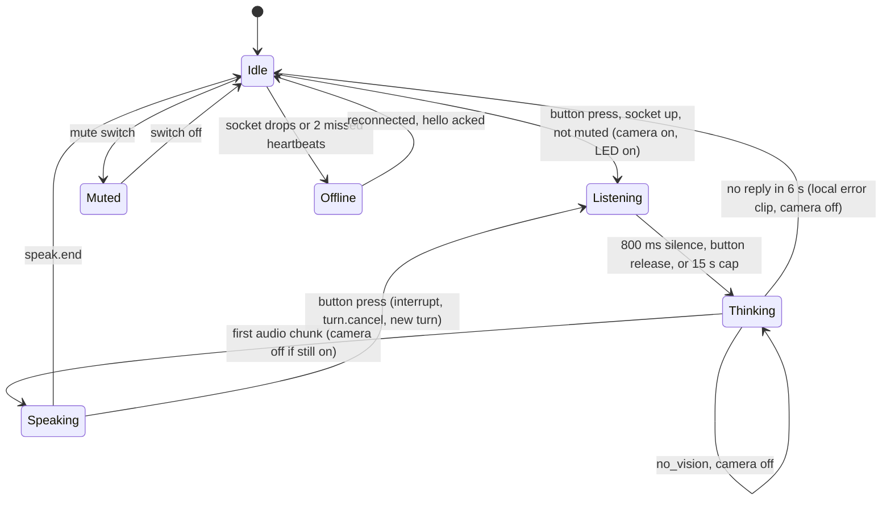

# Vird design document v1.3 (frozen)

**A mirror-mounted assistant that sees what you're wearing, talks with you about it, and remembers every outfit.**

Lam Tran, September 2026. Final version after three review rounds. From here, `docs/schema.sql` is the source of truth for the model and this document describes intent. Changes to the design go through the schema and the code, not through a v1.4.

## What changed since v1.2

- New `assistant` package owns the meaning of a turn. `gateway` and `api` are transport only, so the mirror and the phone run the same product logic.
- Garment gains the attributes deterministic code actually uses: `fit`, `season_tags`, `warmth`, `color_family`. User gains `weather_location`. Price is `price_minor` plus `currency`.
- GarmentExemplar (an image) is split from ExemplarEmbedding (a representation of it under one model).
- Image lifecycle formalized: raw frames in memory only; analysis assets with a short TTL tied to the ObservedFit; retained assets only on explicit confirm or log. Phone fit-check photos that are never logged are deleted.
- Wear removed; wear history derives from Outfit and OutfitItem.
- Suggestion, SuggestedOutfit, and RecommendationEvent persist exactly what was shown.
- Exemplar `source` split into `capture_source` and `creation_reason`. Garment `created_from` gains `mirror`. RecognitionCandidate has an id. Ownership is normalized through parent foreign keys, with RLS walking the chain.
- Camera turns off as soon as the frame is sent or vision is ruled out, and always by `speak.start`. Pairing codes are ephemeral, one-use, rate limited, and never the credential. Mute is software mute in v1, and is described as such.

## What Vird is

- **A device on your mirror.** A Raspberry Pi with a camera, mic, and speaker. Press a button, ask "what should I wear today?" or "what do you think of this?", and it answers out loud. It can tell you the grey overshirt you're wearing is the one you wore Tuesday.
- **An iPhone app.** Your closet, your outfit history, the same assistant in text or voice, and a fit check that does what the mirror does from a photo. For anyone without the device, the app is the whole product.
- **A backend that knows your closet.** Every item, every wear, every wash, today's weather, your style rules. The model is a commodity; this context is what makes the answers yours.

## Why build it

Digital closet apps exist and they all die on the same hill: you have to photograph every item and log every outfit, and by the third week nobody does.

Vird removes the logging. You get dressed, it recognizes what you're wearing, the outfit is logged, and anything it hasn't seen before gets added on the spot. The camera is the wedge; the app is what the camera makes possible.

Personally: I've been obsessed with clothes since 10th grade and I'm active in BU's fashion community, so I'm the first user and I know where the next fifty are. On the engineering side I want to learn Go, run a real service with tracing and deploys, and build a product people use.

## v1 scope

1.  **Suggest.** "What should I wear?", optionally with constraints ("dark colors, something comfy, lab meeting at 3"). Three clearly different outfits from your closet, each with a one-line reason.
2.  **Critique.** "What do you think?" with a frame or photo. Identifies each garment, matches it to your closet or offers to add it, comments on the combination.
3.  **Log.** "Log it." Confirms the current observed fit and saves it to today, in your timezone.

### Deliberately not in v1

- Virtual try-on, planning future days, social features, shopping, streaks.
- Calendar integration. "Lab meeting at 3" in the request is enough.
- Wake word. Every listen starts with a button press. No follow-up without a press.
- Continuous camera. The camera is on only while Vird is determining or capturing the visual context for a request.
- Voice barge-in. Pressing the button while Vird is talking interrupts it.
- Hardware mute isolation. v1 mute is a switch read by software.
- Any inference on the device. Kubernetes. Android.

The device is not built until recognize → correct → critique → log → suggest is something I use on my phone every day and the recognition benchmark passes. If the loop isn't good on a phone, the mirror won't fix it.

## System overview

`gateway` moves audio and frames and holds device sessions. `api` speaks HTTP. Neither knows what a critique is. `assistant` does: it takes a request from either transport, decides the intent and whether vision is needed, runs recognition against the session's ObservedFit, builds context, calls suggest or critique, and returns a response. Recognition ("which exact garments?") and suggest ("do these work together?") stay separate packages with separate evaluation.

Stack: Go, SwiftUI, Python on the Pi, managed Postgres with pgvector, S3-compatible object storage with lifecycle rules, OpenTelemetry tracing and Prometheus metrics from the first deploy, Fly.io or equivalent.

## Domain model

Defined in `docs/schema.sql` with matching Go types. This table describes it; the file is the truth.

| Entity                   | What it is                                          | Key fields                                                                                                                                                                                                                                 |
|--------------------------|-----------------------------------------------------|--------------------------------------------------------------------------------------------------------------------------------------------------------------------------------------------------------------------------------------------|
| **User**                 | An account                                          | id, apple_sub, timezone, weather_location (city text plus derived lat/lon), created_at                                                                                                                                                     |
| **Device**               | A paired mirror                                     | id, user_id, public_key, name, paired_at, revoked_at                                                                                                                                                                                       |
| **Garment**              | One item the user owns                              | id, user_id, category, color (free text), color_family (enum), pattern, material, fit (relaxed \| regular \| slim), season_tags\[\], warmth (1 to 5), name, price_minor, currency, archived, created_from (catalog \| phone_fit \| mirror) |
| **GarmentExemplar**      | One image of a garment                              | id, garment_id, image_key, capture_source (catalog \| phone_fit \| mirror), creation_reason (initial \| confirmation \| correction \| new_garment), quality, created_at                                                                    |
| **ExemplarEmbedding**    | One representation of an exemplar under one model   | exemplar_id, model, vector, created_at. One image, many representations; the active model is configuration                                                                                                                                 |
| **ObservedFit**          | What a camera or photo saw, before confirmation     | id, user_id, session_id, source (mirror \| phone), status (open \| confirmed \| discarded), expires_at, created_at                                                                                                                         |
| **RecognitionCandidate** | One detected garment's match result                 | id, observed_fit_id, analysis_asset_id, best_match (garment_id \| null), alternatives\[\], score, resolution (auto \| confirmed \| corrected \| new \| unknown)                                                                            |
| **AnalysisAsset**        | A temporary image derived during analysis           | id, observed_fit_id, kind (garment_crop \| phone_photo), object_key, expires_at. Deleted when the fit closes or expires; promoted on confirm or log                                                                                        |
| **Correction**           | The user overriding a match                         | id, candidate_id, from_garment_id, to_garment_id (or new); promotes the candidate's asset to a GarmentExemplar                                                                                                                             |
| **Outfit**               | A confirmed set worn together                       | id, user_id, from_observed_fit_id, history_photo_key (nullable), logged_on (user-local date), idempotency_key                                                                                                                              |
| **OutfitItem**           | One garment in an outfit; also the record of a wear | outfit_id, garment_id, role (nullable), layer_position (nullable)                                                                                                                                                                          |
| **WashEvent**            | A garment was washed                                | id, garment_id, washed_at. Wears since wash derives from OutfitItem and WashEvent                                                                                                                                                          |
| **Suggestion**           | One answer to "what should I wear"                  | id, user_id, request_text, weather_snapshot, model, prompt_version, created_at                                                                                                                                                             |
| **SuggestedOutfit**      | One of the outfits shown                            | id, suggestion_id, rank, garment_ids\[\], score, explanation                                                                                                                                                                               |
| **RecommendationEvent**  | What the user did with one shown outfit             | id, suggested_outfit_id, type (shown \| accepted \| rejected \| item_swapped \| logged_as_is \| logged_with_changes \| thumbs_down), detail, created_at                                                                                    |
| **StyleProfile**         | Rules the assistant follows                         | user_id; hard: excluded_categories\[\], excluded_garment_ids\[\], excluded_color_families\[\]; soft: notes\[\]                                                                                                                             |

**Ownership** is normalized. Child rows carry no `user_id`: Exemplar → Garment → User, OutfitItem → Outfit → User, WashEvent → Garment → User, Candidate → ObservedFit → User. Row-level security policies walk the parent chain. There is one ownership mechanism, not two.

**There is no Wear table.** Every wear is an OutfitItem on an Outfit with a `logged_on` date. Wear count, last worn, and wears since wash derive from OutfitItem, Outfit, and WashEvent. One less thing to keep consistent.

**The flow:** photo → ObservedFit → recognition and correction → confirmed Outfit. Nothing touches wear or wash history until confirmation. The open ObservedFit lives in the session and survives across button-press turns, so "is this your other black tee?" followed by a press and "no, the Uniqlo one" still has the crop it needs.

## Image lifecycle

Three classes, one rule each. This is the whole privacy model for images.

| Class          | Examples                                                                        | Where                                                               | Lifetime                                                                                                                                                                  |
|----------------|---------------------------------------------------------------------------------|---------------------------------------------------------------------|---------------------------------------------------------------------------------------------------------------------------------------------------------------------------|
| Raw frame      | Camera frames during a mirror turn                                              | Memory on the device; memory on the server while the turn is active | Never written to storage. Gone at the end of the turn                                                                                                                     |
| Analysis asset | Garment crops from any fit check; the phone photo a user took to ask a question | Object storage, TTL bucket                                          | Until the ObservedFit closes, or 30 minutes, whichever is first. Deleted automatically if the fit is discarded or never logged                                            |
| Retained asset | GarmentExemplar images; history photos                                          | Object storage, private                                             | Until the user deletes the garment or the photo. Created only by an explicit action: confirming or correcting a match, adding a garment, logging an outfit with its photo |

The sentence for the privacy page: Vird never stores mirror video or raw frames. Small garment crops are held for up to 30 minutes so you can correct a match after Vird has stopped talking, and are kept only if you confirm the garment. A fit-check photo from your phone is kept only if you log the outfit.

## Recognition

### Pipeline

1.  `GarmentDetector.Detect(image) → []DetectedGarment`. First implementation: the VLM returns a box per garment. A dedicated detector can replace it behind the same interface.
2.  Crop each detection into an AnalysisAsset. Embed with the active model. Compare against the user's ExemplarEmbeddings for that model in pgvector (exact search is fine at closet scale).
3.  Compute a **recognition score** from: top-1 similarity, margin between top-1 and top-2, agreement across the garment's exemplars, category consistency, and crop quality. Raw similarity is never the confidence.
4.  Resolve by score: high → accept silently; middle → ask, with alternatives; low → new or unknown, offer to add.

Thresholds are hand-set and calibrated on the calibration set only. A wrong automatic match corrupts wear history, wash state, and future suggestions, so asking beats guessing.

### Learning from corrections

When the user confirms or corrects a match, or adds a new garment, the candidate's AnalysisAsset is promoted to a GarmentExemplar with `creation_reason` set accordingly, and embedded under the active model. Switching embedding models is a backfill of ExemplarEmbedding rows, a benchmark run, and a config change.

### Progressive closet building

An unknown garment in a fit check becomes an "add this?" prompt with the crop and suggested attributes. After a couple of weeks the frequently worn items are catalogued without an onboarding session. Bulk add from catalog photos stays as a shortcut.

### Segmentation fallback

- Catalog photos: subject lift on the phone; if the mask fails a sanity check, a garment segmentation model on the backend.
- Fit checks: detector boxes, embedded server-side.
- Manual rectangle in the app, always available.

### Benchmark

25 known garments plus 5 held-out garments absent from the simulated closet, several lighting conditions, real worn and mirror photos. Three splits: calibration (run constantly), validation (milestones), and a final held-out test used for the phone-loop gate. House rule: if a recognition change is made because of something seen on the test set, that set is contaminated and gets fresh examples before it's trusted again. Measured separately:

- **Detection:** garment recall, false detections, box quality.
- **Identification:** top-1 accuracy, false silent match rate, unknown detection.
- **Fit level:** zero-correction fit rate. The number users feel.

With 30 garments, rates like "under 3% false silent match" are directions, not measurements, until real usage accumulates.

## Suggestions

Code filters and scores; the model ranks and explains. Every attribute the code uses exists on Garment.

### Hard constraints

Vird is not allowed to suggest these. Used sparingly: excluded categories, color families, or garments from the style profile; archived items; the wrong garment type for the request.

### Soft penalties

Scored, not removed: past wash threshold, worn recently, recently recommended, warmth mismatch with today's weather, weak color-family compatibility.

### Flow

1.  Apply hard constraints. Turn request words into filters where possible ("dark" → color_family, "comfy" → fit and material) and pass the rest as intent.
2.  Score combinations per role using the penalties and the user's past pairings from OutfitItem. Keep the top 10.
3.  Send the shortlist, the request, the style profile, and the weather snapshot to the model. It returns three outfits with reasons and cannot name an item outside the shortlist. Persist the Suggestion and its three SuggestedOutfits, including model and prompt version.
4.  **Diversity requirement:** the three must differ meaningfully.

### Swap one item

Deterministic. Keep the other garments fixed, filter candidates for that role, score against the rest, exclude the current item, return the next best. Recorded as an `item_swapped` event with from and to.

### Style profile

Free-text notes are context for the model. Hard rules are structured. "Never suggest shorts" is translated once into `excluded_categories += shorts` and shown back for confirmation.

## iPhone app

SwiftUI, iPhone only for now.

### Today

The assistant at the top: one input with a camera button (fit check, with a photo picker), a text field, and a mic button using the iOS Speech framework. Voice and text hit the same `assistant` entry point through `api`. Below: three suggestion cards, one highlighted as the top pick, each with a reason. Swipe a card to swap one item. Weather as a chip in the header. Once an outfit is logged, the logged outfit grows and the suggestions collapse.

### Fit check and correction

Take or pick a photo. It becomes an AnalysisAsset on an open ObservedFit. The sheet shows each detected garment with its match and score: confident matches plainly, uncertain ones with alternatives, unknown ones as "add to closet?" with autofilled attributes. Every correction is one tap. Ask the assistant from this sheet, or log. Closing the sheet without logging discards the fit and its photo. This sheet is the onboarding.

### Closet

A grid of item cutouts, filterable by category, color family, season, and wash state, with search. Items show where they came from and how many exemplars recognition has. Item detail: wears, last worn, wears since wash, cost per wear, outfits it appeared in, a "washed" button. Bulk add from catalog photos available but not required.

### History

A month calendar with a thumbnail on every logged day: the history photo if one exists, otherwise a collage of the outfit's catalog cutouts. Stats: most and least worn, untouched for 90 days, cost per wear, repeated combinations. Laundry list of items past their wash count, with tick-off and "mark all washed". No scheduler, no reminders.

### Settings

Account. Weather location, set as a city. Paired devices with revoke, and "pair a device" where the code from the setup CLI is entered. Mute schedule. Privacy: the image lifecycle in plain words, the audit log of every image sent, and photo deletion. Style profile: structured exclusions shown as chips, plus free-text notes.

## Mirror device

### Hardware

Raspberry Pi 5 (8 GB), Camera Module 3 wide, ReSpeaker 2-mic HAT or USB conference mic, small USB speaker, one push-to-talk button, one status LED, one mute switch read over GPIO. No display. About \$150, no soldering.

### Software

Three small Python services under systemd and one state machine.

- **Ears.** Mic into a voice activity detector (Silero VAD). Opus, 20 ms frames, streamed while you're still talking.
- **Core.** State machine, GPIO for button, LED, and mute, one persistent WebSocket with the device credential. On button press the camera turns on and the newest frame is kept in RAM, replaced continuously. The camera turns off at the first of: the frame is uploaded after `frame.request`, the backend sends `no_vision`, or `speak.start` arrives. The LED follows the camera.
- **Voice.** Streams reply audio to the speaker. A button press during playback stops it, sends `turn.cancel`, and starts a new turn.

The promise: the camera is active only while Vird is determining or capturing the visual context for your request, and the LED is on for exactly that window. Mute in v1 is a switch the software honors; it is not hardware isolation, and the privacy page says so.

### State machine

Every listen starts with a button press. Muted and Offline are entered from any state. Every transition goes through one function and emits a `state` message.

### When offline

Slow red blink. A button press plays a pre-rendered clip from disk. Reconnect with exponential backoff, 1 s to 30 s with jitter. A mid-turn drop abandons the turn. Tested early by killing the backend mid-sentence.

## Backend

One Go binary with package boundaries, one process, managed Postgres and object storage.

- `api`: HTTP transport for the app. Auth, request parsing, response shaping. Calls `assistant` for anything that means something.
- `gateway`: WebSocket transport for devices. Sessions, audio streaming to and from the speech models, frame transport, `frame.request` and `no_vision` signalling on behalf of `assistant`. Starts with a speech-to-speech API, swaps to the full pipeline once proven.
- `assistant`: the product. Turn lifecycle, intent (suggest \| critique \| log \| question), whether vision is needed, the open ObservedFit per session, calling recognition, context, and suggest, composing the response. Phone and mirror both land here.
- `recognition`: detector interface, embedding, scoring, corrections, asset promotion, benchmark harness.
- `suggest`: constraints, penalties, scoring, shortlist, diversity, swap, model ranking, suggestion persistence.
- `context`: wardrobe, wear history, wash state, weather for the user's location, style profile.
- `store`: Postgres, pgvector, object storage with TTL buckets. RLS on.

### Observability

One trace per turn: audio → STT → intent → frame → detection → embedding → matching → context → model → TTS → speaker. Prometheus for aggregates, Grafana for both.

## Message contract

Written after the phone loop is proven. Lives in `proto/`. One WebSocket; JSON text frames for control, binary frames for audio and images.

    { "v": 1, "type": "turn.start", "session": "s_7f3a", "turn": "t_0041",
      "seq": 42, "ts": 1757200000123, "data": { } }

| Device to backend                                      | Backend to device                                  |
|--------------------------------------------------------|----------------------------------------------------|
| `hello` device_id, fw, caps, proto                     | `hello.ack` session policy, mute schedule          |
| `turn.start` trigger, camera_active                    | `frame.request` turn                               |
| `turn.end` reason: vad, button, timeout                | `no_vision` turn                                   |
| `turn.cancel` reason: button, timeout                  | `stt.partial` text (optional)                      |
| `frame` jpeg, w, h, captured_at, then one binary frame | `speak.start`, `audio.chunk` (binary), `speak.end` |
| `state` from, to, at                                   | `event` outfit_logged, needs_confirmation, error   |
| `metrics` turn, stage, ms; `ping`                      | `config`, `pong`                                   |

`turn` is on every message; late messages for a finished turn are discarded. Binary frames carry a 6-byte header (kind, codec, turn sequence, chunk sequence). Opus, 16 kHz mono, 20 ms chunks. Logging carries an idempotency key from the observed fit. The device never sends a transcript or an interpretation. `caps` is the only v2 hook.

## Auth, pairing, access

### Users

A fixed dev account during early development; Sign in with Apple before the app goes to a second person. Short-lived access tokens with refresh.

### Device pairing

1.  The setup CLI flashes the device. On first boot the device generates a keypair and opens a pending pairing with the backend using its public key.
2.  The backend returns a six-digit code, valid for five minutes, single use, rate limited per pending device and per user. The CLI prints it.
3.  The user enters the code in Settings. The backend binds the pending device to the user and issues the device credential, bound to the device's key.
4.  The code is never the credential. Devices are listed in Settings and can be revoked, which invalidates the credential immediately.

### Access

- TLS everywhere, including the WebSocket. Private object storage with short-lived signed URLs.
- Ownership normalized through parent foreign keys. Postgres row-level security walks the chain; the store layer sets the current user per request. One ownership mechanism.

## Privacy and retention

Images follow the three-class lifecycle above. In addition:

- Vird never persists raw mirror frames. They are held for the active turn and sent to the configured inference providers only when the turn needs vision. Provider retention policies are documented separately, and providers are chosen with retention in mind.
- The camera is active only while Vird is determining or capturing the visual context for a request. The LED is on for exactly that window.
- A frame leaves the device only when the backend asks for one.
- Mute in v1 is honored by software. It is not hardware isolation.
- The privacy page shows an audit log of every image sent, with time and purpose, and the lifecycle table in plain words.

## Quality metrics

| Metric                     | Definition                                                        | Target                                  |
|----------------------------|-------------------------------------------------------------------|-----------------------------------------|
| Zero-correction fit rate   | Fit checks where every garment is right without user intervention | 70%, trending up with exemplars         |
| Garment recall             | Detection: garments found / garments present                      | 95%                                     |
| Top-1 accuracy             | Identification, per garment, held-out test                        | 90%                                     |
| False silent match         | Wrong garment accepted without asking                             | Under 3% (directional until real usage) |
| Unknown detection          | Held-out garments correctly flagged as unknown                    | 85%                                     |
| Correction rate            | Fit checks with at least one correction, in daily use             | Under 20% after one month               |
| Suggestion acceptance      | A shown outfit gets logged that day                               | Over 30%                                |
| Latency, voice only        | End of speech to first audio                                      | p95 under 1.5 s                         |
| Latency, voice + vision    | End of speech to first audio                                      | p95 under 3 s                           |
| Latency, phone fit check   | Photo submit to correction sheet                                  | p95 under 4 s                           |
| Failures                   | Turns ending in timeout or error                                  | Under 2%                                |
| Segmentation fallback rate | Catalog photos needing the server model or a manual crop          | Tracked                                 |
| Cost                       | Dollars per turn and per active user per day                      | Known before user \#2                   |

## v2: on-device inference

Not built toward beyond `caps`. The Raspberry Pi AI HAT+ 2 (Hailo-10H, 40 TOPS INT4, 8 GB on-board, currently \$200) runs small LLMs and VLMs locally. The intended split keeps style reasoning in the cloud and uses the local model for perception and structured extraction: speech-to-text, garment crops and embeddings, coarse labels. Frames would never leave the room and recognition would work offline. Whether it ships depends on whether users care, which v1 will show.

## Risks, in order

1.  **Finishing.** Recruiting season, two lab roles, courses. Defense: scope and the phone-first gate. Not using the phone loop daily by end of October means the scope is wrong.
2.  **Zero-correction fit rate.** Measured, not estimated. If it can't reach the target with off-the-shelf models plus per-closet exemplars, the product needs rethinking before hardware.
3.  **Voice reliability and latency.** Push-to-talk and button interrupt remove the hardest parts.
4.  **Other people using it.** Progressive closet building makes the phone-only version viable. Whether five people stick with it is the open question.

## Build order

1.  Repo `virdlabs/vird`. Write `docs/schema.sql` and the Go types from the domain model above. Generate migrations from it. Enable RLS in the first migration.
2.  Backend skeleton: dev account, `assistant` with the critique and log intents, garments and outfits API, managed Postgres, object storage with the TTL bucket, one deploy, tracing and metrics.
3.  Recognition package and the benchmark: 25 known plus 5 held-out garments, calibration, validation, and test splits, detection and identification metrics, zero-correction fit rate.
4.  App: fit check with the correction sheet first, then Today with the assistant, then Closet, then History.
5.  Suggest package: hard constraints, penalties, shortlist, diversity, deterministic swap, suggestion persistence.
6.  **Gate:** daily use of the full phone loop for two weeks. Benchmark targets met on the held-out test.
7.  Device protocol into `proto/`. `gateway` on the backend.
8.  Device: state machine, button, LED, mute, WebSocket client, rolling frame with early camera-off, pairing flow. On the mirror. Kill the backend mid-sentence.
9.  Sign in with Apple, revocation, RLS review. Hand the app to five people.

This document is frozen. Design changes from here happen in `docs/schema.sql`, `proto/`, and the code, with a line in `docs/decisions.md` when they matter.
